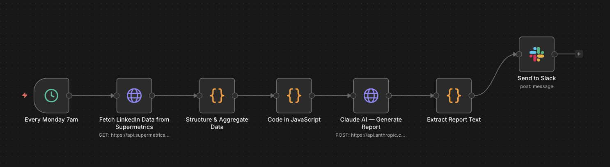

# LinkedIn Ads Automated Report — n8n + Claude AI

No more pulling LinkedIn Ads data manually every week. This n8n workflow runs every Monday at 7am, fetches the latest campaign data via Supermetrics, aggregates the key metrics, sends everything to Claude for analysis, and posts a full performance report straight to Slack.

Zero manual work. Just open Slack on Monday morning.

---

## Preview

---

## How it works

1. **Trigger** — runs automatically every Monday at 7am
2. **Fetch** — pulls LinkedIn Ads data (impressions, clicks, spend, CTR, CPM) via Supermetrics API
3. **Aggregate** — structures and formats the raw data into a clean summary
4. **Analyse** — sends the data to Claude API which generates a written performance commentary with recommendations
5. **Deliver** — posts the full report (metrics + AI analysis) to a Slack channel

---

## Stack

n8n · Supermetrics · Claude API (Anthropic) · Slack · JavaScript

---

## Setup

**Requirements**
- n8n instance (self-hosted or cloud)
- Supermetrics account with LinkedIn Ads connector
- Anthropic API key
- Slack webhook or bot token

**Import the workflow**
- Download `linkedin_ads_report.json`
- In n8n → Import workflow → upload the file

**Configure credentials**
- Supermetrics: add your API key in the HTTP Request node
- Claude: add your Anthropic API key in the Claude node
- Slack: connect your Slack workspace and set the target channel

**Set your schedule**
- Default is every Monday at 7am — adjust the Schedule Trigger node to fit your timezone
